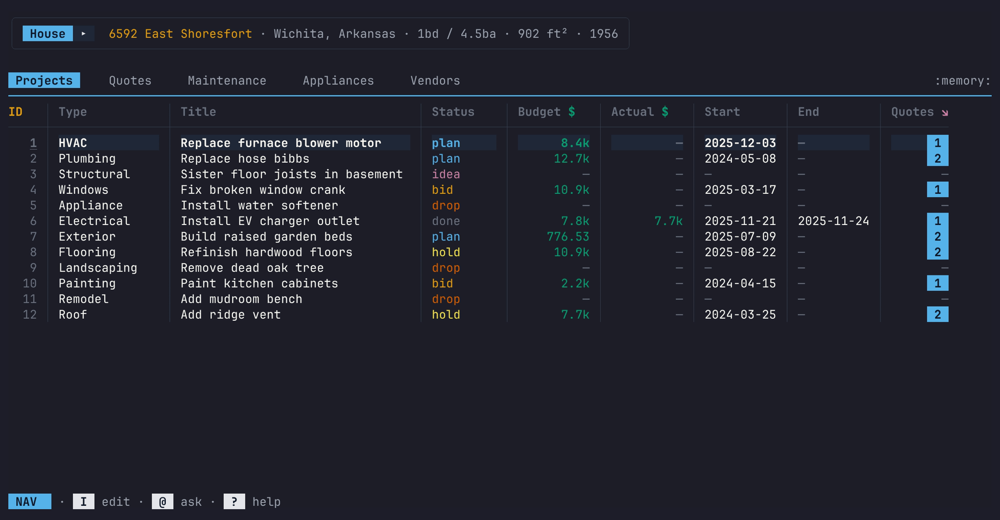

<!-- Copyright 2026 Phillip Cloud -->
<!-- Licensed under the Apache License, Version 2.0 -->

<div align="center">
  

  <br><br>

  [](https://github.com/cpcloud/micasa/actions/workflows/ci.yml)
  [](https://github.com/cpcloud/micasa/releases/latest)
  [](https://go.dev)
  [](https://micasa.dev/docs)
</div>

# `micasa`

Your house is quietly plotting to break while you sleep -- and you're dreaming about redoing the kitchen. `micasa` tracks both from your terminal.

> Single SQLite file. No cloud. No account. No subscriptions.

<div align="center">
  
</div>

## Features

- **When did I last change the furnace filter?** Maintenance schedules, auto-computed due dates, full service history.
- **What if we finally did the backyard?** Projects from napkin sketch to completion -- or graceful abandonment.
- **How much would it actually cost to...** Quotes side by side, vendor history, and the math you need to actually decide.
- **Is the dishwasher still under warranty?** Appliance tracking with purchase dates, warranty status, and maintenance history tied to each one.
- **The basement is leaking again.** Log incidents with severity and location, link them to appliances and vendors, and resolve them when fixed.
- **Who did we use last time?** A vendor directory with contact info, quote history, and every job they've done for you.
- **Where's the warranty card?** Attach files (manuals, invoices, photos) directly to projects and appliances. Stored as BLOBs in the same SQLite file -- one `cp` backs up everything.
- **How much have I spent on plumbing?** Press `@` to chat with a local LLM about your data. It writes the SQL, runs the query, and summarizes the results -- all on your machine.

## Keyboard driven

Vim-style modal keys: `nav` mode to browse, `edit` mode to change things. Sort by any column, jump to columns with fuzzy search, hide what you don't need, and drill into related records.

See the full [keybinding reference](https://micasa.dev/docs/reference/keybindings/).

## Local LLM chat

Ask questions about your home data in plain English. micasa connects to a local [Ollama](https://ollama.com) server (or any OpenAI-compatible API) and translates your question into SQL, executes it, and summarizes the results.

The model has access to your schema and actual database values, so it can handle fuzzy references like "plumbing stuff" or "planned projects." Toggle `ctrl+s` to see the generated SQL, or `ctrl+o` for [mag mode](https://magworld.pw) that replaces dollar amounts with their order of magnitude.

See the [LLM chat guide](https://micasa.dev/docs/guide/llm-chat/) and [configuration reference](https://micasa.dev/docs/reference/configuration/) for setup.

## Install

Requires Go 1.25+:

```sh
go install github.com/cpcloud/micasa/cmd/micasa@latest
```

Or grab a binary from the [latest release](https://github.com/cpcloud/micasa/releases/latest).

Linux, macOS, and Windows binaries are available for amd64 and arm64.

```sh
micasa --demo         # poke around with sample data
micasa                # start fresh with your own house
micasa --print-path   # show where the database lives
```

> One SQLite file. Your data, your machine. Back it up with `cp`.

Need Nix or container install options? Use the full [installation guide](https://micasa.dev/docs/getting-started/installation/).

## Documentation

Full docs at [micasa.dev/docs](https://micasa.dev/docs/) -- start with [Installation](https://micasa.dev/docs/getting-started/installation/) and [First Run](https://micasa.dev/docs/getting-started/first-run/), then use the [Guide](https://micasa.dev/docs/guide/) and [Reference](https://micasa.dev/docs/reference/).

## Development

[Pure Go](https://go.dev), zero CGO. Built on [Charmbracelet](https://github.com/charmbracelet) + [GORM](https://gorm.io) + [SQLite](https://sqlite.org). TUI design inspired by [VisiData](https://www.visidata.org/) -- modal navigation, column-level operations, and keyboard-driven data exploration. Developed with AI coding agents ([Claude](https://claude.ai), [Claude Code](https://claude.ai/code)).

PRs welcome -- including AI-assisted ones, as long as you've reviewed and curated the code. See the [contributing guide](https://micasa.dev/docs/development/contributing/) for details. The repo uses a [Nix](https://nixos.org) dev shell with pre-commit hooks for formatting, linting, and tests:

```sh
nix develop          # enter dev shell
go test -shuffle=on ./...        # run tests
```

## License

Apache-2.0 -- see [LICENSE](LICENSE).
