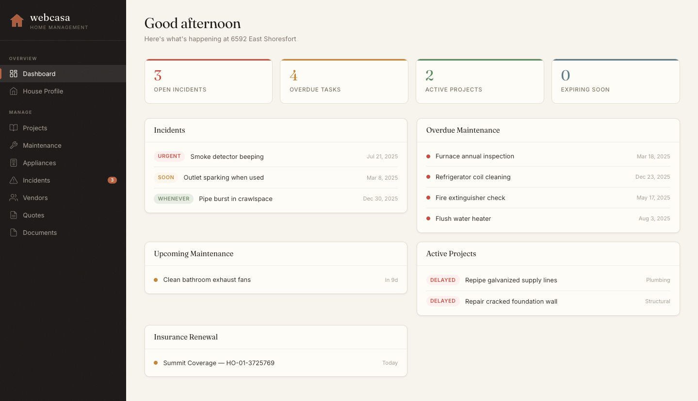

# webcasa

A web interface for managing everything about your home -- projects, maintenance, appliances, vendors, documents, and more.

Built on the data layer and REST API from [micasa](https://github.com/cpcloud/micasa) by [Phillip Cloud](https://github.com/cpcloud). The original project is a terminal UI (TUI) for home management; **webcasa** provides the same functionality through a browser.



## Features

- **Dashboard** -- at-a-glance view of open incidents, upcoming maintenance, active projects, expiring warranties, recent service logs, and spending summaries
- **Projects** -- track home improvement projects with types, status, budget, and timelines
- **Quotes** -- collect and compare vendor quotes linked to projects
- **Vendors** -- manage contractor and service provider contacts
- **Maintenance** -- schedule recurring maintenance with categories and intervals
- **Service Log** -- record service visits with cost tracking and vendor links
- **Appliances** -- catalog appliances with warranty dates, serial numbers, and costs
- **Incidents** -- log problems with severity, status, and links to appliances/vendors
- **Documents** -- attach files (invoices, manuals, photos) to any entity
- **Soft delete / restore** -- nothing is permanently lost; deleted items can be restored
- **Demo mode** -- launch with sample data to explore the interface

## Quick start

```
go build -o webcasa ./cmd/webcasa
./webcasa --demo
```

Open [http://localhost:8080](http://localhost:8080) in your browser.

### Flags

| Flag | Default | Description |
|------|---------|-------------|
| `-addr` | `:8080` | Listen address (host:port) |
| `-db` | platform data dir | SQLite database path |
| `-demo` | `false` | Seed demo data into an in-memory database |
| `-web-dir` | `web` | Path to the `web/` directory for static files |

### Database location

When no `-db` flag is provided (and not in demo mode), the database is created at the platform-standard data directory:

- **macOS**: `~/Library/Application Support/webcasa/webcasa.db`
- **Linux**: `$XDG_DATA_HOME/webcasa/webcasa.db` (default `~/.local/share`)
- **Windows**: `%LOCALAPPDATA%/webcasa/webcasa.db`

Override with the `WEBCASA_DB_PATH` environment variable.

## Configuration

webcasa reads an optional TOML config file from `$XDG_CONFIG_HOME/webcasa/config.toml`. Environment variables override file values.

| Setting | Env var | Default |
|---------|---------|---------|
| LLM base URL | `OLLAMA_HOST` | `http://localhost:11434/v1` |
| LLM model | `WEBCASA_LLM_MODEL` | `qwen3` |
| LLM timeout | `WEBCASA_LLM_TIMEOUT` | `5s` |
| Max document size | `WEBCASA_MAX_DOCUMENT_SIZE` | `52428800` (50 MiB) |
| Cache TTL (days) | `WEBCASA_CACHE_TTL_DAYS` | `30` |

## API

All endpoints live under `/api/`. The web frontend at `/` is a single-page app that consumes these endpoints.

Full CRUD is available for: projects, quotes, vendors, maintenance, service logs, appliances, incidents, and documents. Each entity supports soft delete (`DELETE`) and restore (`POST .../restore`).

See `internal/api/server.go` for the complete route table.

## Credits

This project is derived from [micasa](https://github.com/cpcloud/micasa) by [Phillip Cloud](https://github.com/cpcloud), licensed under the Apache License 2.0. The data layer, models, and REST API are from the original project. webcasa strips the terminal UI and packages the web frontend as a standalone application.

## License

[Apache License 2.0](LICENSE)
