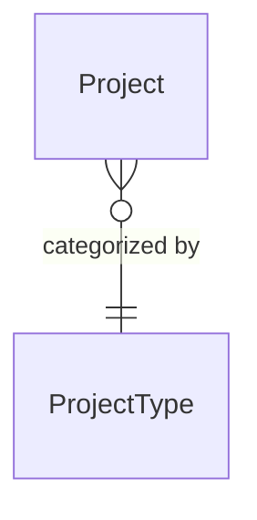
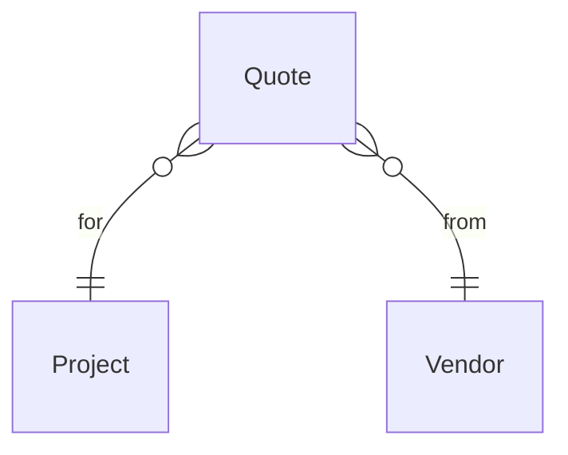
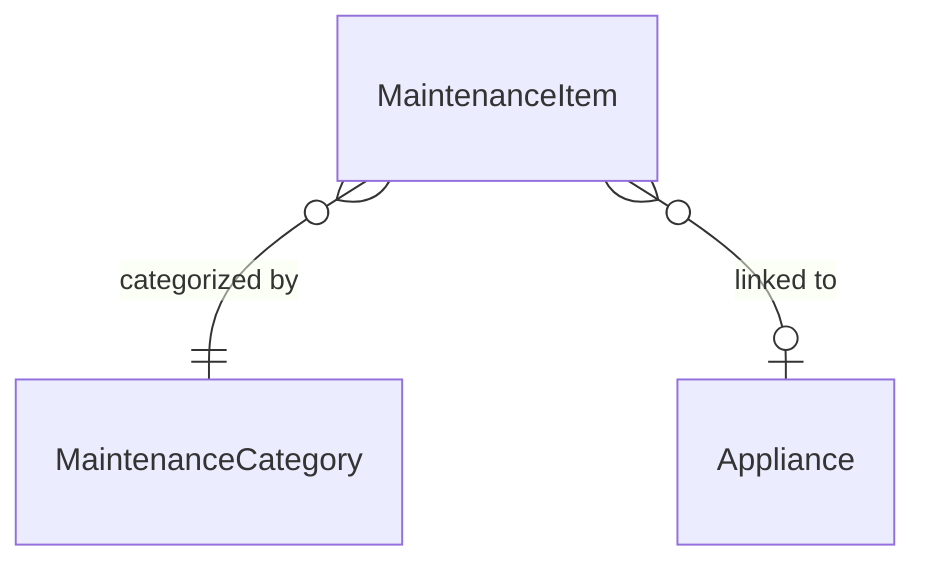
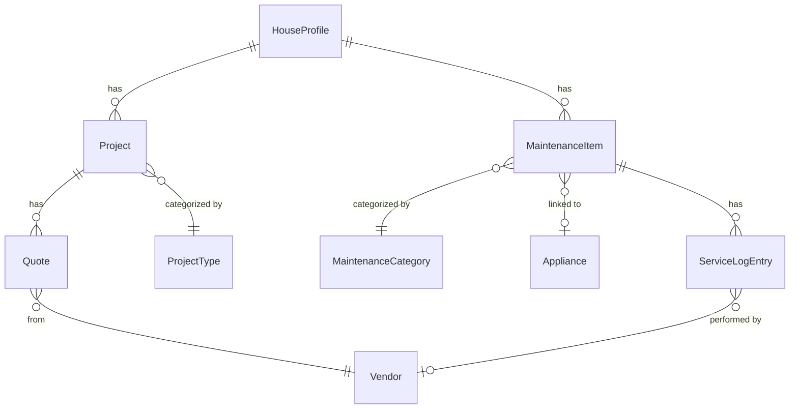

+++
title = "Concepts"
weight = 3
description = "How micasa organizes your home data."
linkTitle = "Concepts"
+++

micasa organizes home data into a few interconnected entities.

## House Profile

Your home's physical details: address, year built, square footage, bedrooms,
bathrooms, structural info (foundation, wiring, roof), utilities (heating,
cooling, water, sewer), and financial info (insurance, property tax, HOA).
There's exactly one house profile per database.

## Projects

Anything you want to do to your house, from "fix the squeaky door" to "redo
the kitchen." Each project has:

- `Type` (e.g., Renovation, Repair, Landscaping) -- these are pre-seeded
  categories
- `Status` tracking a lifecycle: ideating, planned, quoted, underway,
  delayed, completed, abandoned
- `Budget` and `Actual` cost for tracking spending
- `Start` and `End` dates

### Why this matters

The `Type` column is a select drawn from pre-seeded project types. This keeps
**naming consistent** -- you won't end up with "Renovation", "renovation", and
"Reno" as three separate categories.

## Quotes

Vendor quotes linked to a project. Each quote has:

- `Vendor` info (name, contact, email, phone, website) -- vendors are
  shared across quotes and service log entries
- Cost breakdown: `Total`, `Labor`, `Mat`, `Other`
- `Recv` date

### Why this matters

Every quote belongs to a project and comes from a vendor. In the UI this
means:

- The `Project` column is a **live link** -- press `enter` to jump straight to
  that project. The header shows `→` so you know it's navigable.
- You can't accidentally create an orphan quote; micasa **requires a project**
  before you can add one.
- Vendor records are **shared**: the same vendor appears across all their
  quotes and service log entries, so contact info stays in one place.

## Maintenance

Recurring upkeep tasks. Each maintenance item has:

- `Category` (e.g., HVAC, Plumbing, Electrical) -- pre-seeded
- `Appliance` link (optional) -- ties the task to a specific appliance
- Schedule: `Last` serviced date + `Every` (interval in months)
- `Next` due date: auto-computed from `Last` + `Every`
- `Log`: a time-ordered history of when the task was actually
  performed, by whom, and at what cost

### Why this matters

Categories work like project types -- a **fixed set** so filtering and sorting
stays clean. The appliance link is optional (not every task involves a specific
piece of equipment), but when present it enables **bidirectional navigation**:

- Press `enter` on the `Appliance` column to jump to that appliance
- See the `Maint` count on the Appliances tab, showing all tasks tied to it
- Drill down from an appliance to its linked maintenance items

The `Log` column is a **drilldown** (marked `↘` in the header) -- press `enter` to open the full service
history for that item.

## Service Log

Each entry in a maintenance item's service log records:

- `Date` serviced
- `Performed By`: yourself ("Self") or a vendor
- `Cost`
- `Notes`

### Why this matters

Service log entries live inside a maintenance item (you get to them by
drilling down from the `Log` column), so they **always have context** -- you
never see a floating service record without knowing what it was for. The
optional vendor link means you can track whether you did the work yourself or
hired someone, and if hired, which vendor -- their contact info carries over
automatically. The `Performed By` column is a **live link** -- when at
least one entry was performed by a vendor the header shows `→`; press
`enter` to jump to that vendor in the Vendors tab.

## Appliances

Physical equipment in your home. Each appliance tracks:

- Identity: `Name`, `Brand`, `Model`, `Serial`, `Location`
- `Purchased` date and `Warranty` expiry
- `Cost`
- Linked maintenance: the `Maint` column shows how many maintenance
  items reference this appliance. Press `enter` to drill into them.

### Why this matters

Appliances are referenced by maintenance items, so the relationship flows the
other way: you don't pick maintenance tasks from the appliance form, you pick
an appliance from the maintenance form. But the `Maint ↘` column gives
you the **reverse view** -- from any appliance, see everything you're doing to
keep it running.

## Vendors

Vendors are people and companies you hire. They have their own tab showing
name, contact, email, phone, website, plus aggregate counts: how many quotes
and service log entries reference each vendor.

Vendors are also created implicitly through the Quotes and Service Log forms --
type a vendor name and micasa finds or creates the record.

### Why this matters

Because vendors are shared, updating a vendor's phone number **in one place**
updates it everywhere. The Vendors tab gives you a bird's-eye view of everyone
you've worked with and how often, while the `Vendor` column on the Quotes tab
is a **live link** -- press `enter` to jump to that vendor's record.

## Relationships

These connections show up in the UI in a few ways:

- **Linked columns** (marked `→` in the header when links exist) let you
  press `enter` to jump directly to the related record -- from a quote to
  its project, from a maintenance item to its appliance, etc.
- **Drilldown columns** (`Log` on Maintenance, `Maint` on Appliances) open a
  sub-table showing all child records for that row.
- **Required links** prevent orphan data: you can't create a quote without a
  project, or a service log entry without a maintenance item.
- **Shared references** like vendors keep contact info in one place and
  consistent across all quotes and service entries.

## Soft delete

All entities support soft deletion. Deleting an item hides it from the default
view but doesn't destroy data. Press `x` in Edit mode to toggle showing
deleted items, and `d` on a deleted item to restore it.
